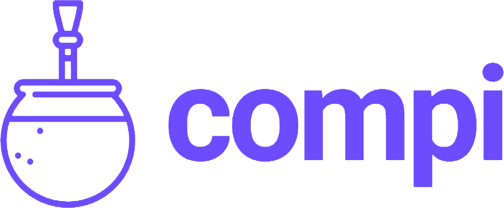
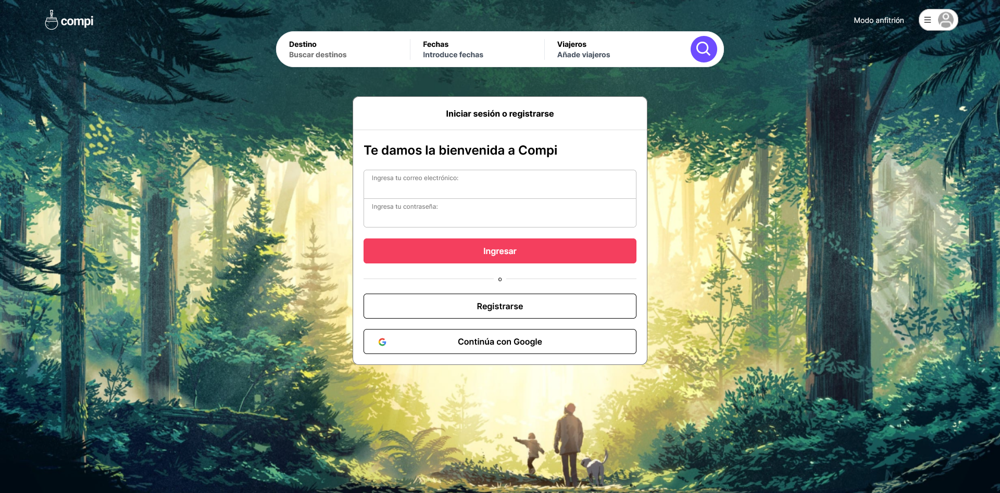
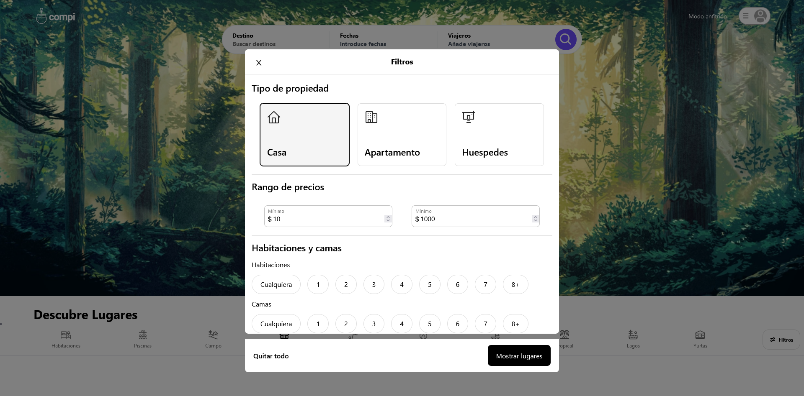

### c11-30-ft-node-react

 

# Compi

 

### Descripción

Compi es una aplicación web de alquiler de alojamiento para viajantes, es una plataforma en línea diseñada para facilitar el proceso de búsqueda, reserva y alquiler de alojamientos temporales para personas que están de viaje.

Nos basamos principalmente en Airbnb y su funcionamiento, esta web ofrece alojamiento en línea con más de 7 millones de alojamientos únicos en todo el mundo. con nuestro equipo, nos enfrentamos al desafío de clonar sus funciones, estructuras y características esenciales, mas la creación de un logotipo para identificarla.

 

### Logotipo

#### Logo

El mate representa una práctica social arraigada y una muestra de hospitalidad.

#### Nombre

Abreviatura de compañero de viaje, aun estando solo o en grupo.

#### Colores

La combinación de colores garantiza una experiencia visual agradable y coherente.

 

### Características Técnicas

#### Api de Google Maps

La API de Google Maps es indispensable para recrear la funcionalidad de ubicación y navegación de la página original.

#### Método de Pago

Manejo de pagos en línea para generar un flijo de ingresos deguro mediante tarjeta de crédito, débito o transacciones en línea.

#### Responsive Design

Garantiza que la interfaz del usuario y la experiencia sean agradables en cualquier dispositivo, como tablets y móviles

 

### Funcionalidades Escenciales

#### Autenticación y Verificación del usuario
#### Capacidades de Reservas
#### Modo Nocturno
#### Detalles de alojamientos
#### preguntas frecuentes

 

## Equipo C11-30

### UX/UI
* [Sarkis Florencia](https://www.linkedin.com/in/ezequiel-soto/)

### Frontend
* [Mella García Rafael](https://www.linkedin.com/in/mellarafael)

### Backend
* [Faino Pedro](https://www.linkedin.com/in/pedro-faino/)
* [Miche Miguel](https://www.linkedin.com/in/miguelmiche/)

### Team Leader
* [Samuel Cárdenas](https://www.linkedin.com/in/samuxui/)

 

## Tecnologías y Herramientas
1.      
   
2.      

3. 

 

## Deploy
* Web Page: [Compi-Web](https://air-bnb-clone-tawny.vercel.app/)
* Figma: [Compi-Design](https://www.figma.com/file/J3Sxvzqo52NJZeyhqM0D29/Cohorte?type=design&node-id=4%3A2988&t=4NOikGAT7REMfnx2-1)

 

## Galería

